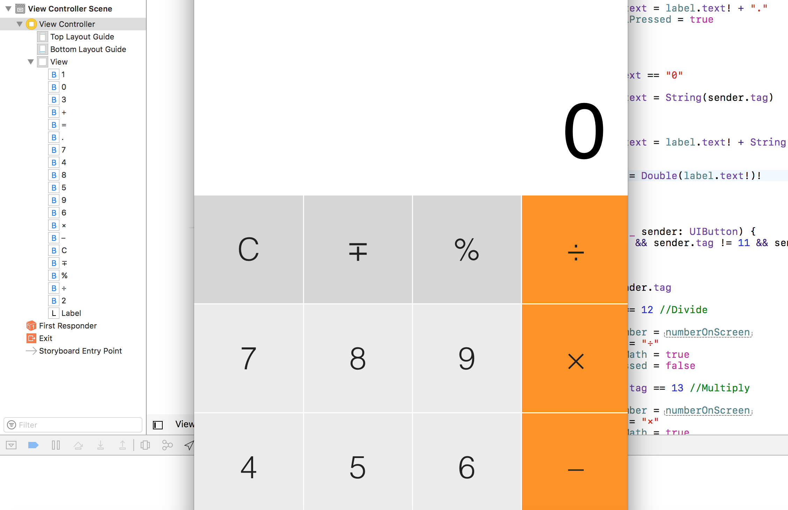
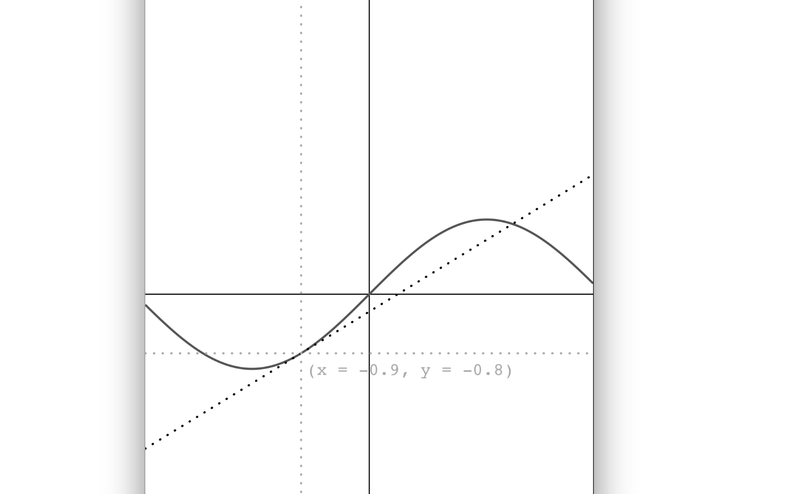

# Introduction to iPhone Development

The repo is created for my intro course in iPhone development. The repo up to now contains the following iPhone projects:
- Calculator

<cener></cener>

- Graphing Calculator

